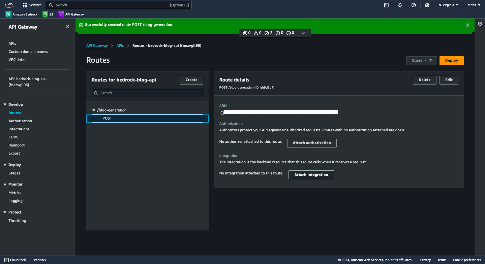

# Serverless Blog Creation with AWS Bedrock, Lambda, S3 & API Gateway

## Overview

This project is an AWS Lambda function that leverages the `meta.llama3-8b-instruct-v1:0` model from AWS Bedrock to generate blog content based on user-defined topics. The generated content is then saved to an Amazon S3 bucket for easy access and management. The function supports customizable blog lengths, keyword inclusion for SEO, and generates metadata for each blog post.


## Features

- **Blog Generation**: Generate high-quality blog posts on various topics.
- **Customizable Lengths**: Users can specify the desired length of the blog post (e.g., 200 words, 500 words).
- **SEO Optimization**: Include keywords in the blog for better search engine visibility.
- **Metadata Tracking**: Automatically saves metadata such as blog topic, generation timestamp, and summary.
- **AWS Integration**: Seamlessly integrates with AWS Bedrock for model invocation and S3 for storage.
- **Logging**: Provides comprehensive logging for debugging and monitoring.

## Requirements

- **AWS Account**: You must have an active AWS account with access to AWS Bedrock and S3.
- **IAM Role**: Ensure you have an IAM role with the necessary permissions to invoke Bedrock models and access S3.
- **Python Version**: The code is compatible with Python 3.x.

## Installation

Follow these steps to set up the project locally:

1. **Clone the Repository**:

   ```bash
   git clone https://github.com/itsmohitkumar/blog-generation-bedrock
   cd blog-generation-bedrock
   ```

2. **Create a Virtual Environment (optional but recommended)**:

   ```bash
   python -m venv venv
   source venv/bin/activate  # For Windows use `venv\Scripts\activate`
   ```

3. **Install Required Packages**:

   ```bash
   pip install -r requirements.txt
   ```

## Configuration

### Environment Variables

Before running the Lambda function, set the following environment variables:

- **`AWS_REGION`**: The AWS region where your services are located (default: `us-east-1`).
- **`MODEL_ID`**: The ID of the Bedrock model to use for blog generation (default: `meta.llama3-8b-instruct-v1:0`).
- **`S3_BUCKET`**: The name of the S3 bucket where the generated blog content will be stored (default: `blog-generation-s3bucket`).

## Amazon S3 Bucket Setup

Amazon S3 is a scalable object storage service that allows you to store and retrieve any amount of data at any time. Below are the steps to set up an S3 bucket and configure its properties.

### Step 1: Accessing S3 and Creating a Bucket


Navigate to the **Amazon S3** service from the AWS Management Console. Buckets in S3 are used to store objects, and they act as containers for your data.

- To create a new bucket, click **Create bucket**.
- You will see a list of existing buckets, if any, under your account. For example, the bucket `blog-generation-s3bucket` is shown in the image above.
- Each bucket is region-specific, and in this case, the bucket is located in the **US East (N. Virginia)** region.

### Step 2: Configuring the S3 Bucket


When creating a new S3 bucket, you'll need to configure its settings:

- **Bucket Type:** Choose between general-purpose and directory buckets. General-purpose buckets are recommended for most use cases and allow for a mix of storage classes.
- **Bucket Name:** Enter a globally unique name for your bucket. For example, `blog-generation-s3bucket` is the name used in this setup.
- **Object Ownership:** You can choose to disable Access Control Lists (ACLs) for the bucket, meaning all objects are owned by the bucket's AWS account, and access is controlled via policies.

### Step 3: Adding Tags and Enabling Encryption


After the initial configuration, you can add additional properties to your bucket:

- **Tags (Optional):** Tags can help organize and track storage costs by assigning metadata to your bucket.
- **Encryption:** Server-side encryption is automatically applied to all objects stored in the bucket. You can choose between:
  - **SSE-S3 (Amazon S3 Managed Keys)**
  - **SSE-KMS (AWS Key Management Service Keys)**
  - **DSSE-KMS (Dual-layer encryption with AWS KMS)**

### Step 4: Uploading Objects to the Bucket


Once the bucket is created, you can start uploading objects:

- In the **Objects** tab, you will see a list of files and folders stored in the bucket. For example, the folder `blog-output/` is present in the `blog-generation-s3bucket`.
- You can upload files and create folders using the **Actions** menu.
- Each object stored in S3 has a unique S3 URI and URL that you can copy for reference or downloading.

## Amazon Bedrock Setup

Amazon Bedrock is a fully managed service that provides access to foundation models (FMs) from leading AI startups and Amazon, allowing you to build and scale generative AI applications without managing any infrastructure. Below are the steps to get started with Amazon Bedrock:

### Step 1: Overview of Amazon Bedrock


Navigate to the **Amazon Bedrock** service on AWS. Amazon Bedrock offers a fully managed environment that enables you to access foundation models via an API. Some key benefits include:

- **Scalability:** Quickly scale generative AI applications using foundation models without managing infrastructure.
- **Variety of Models:** Choose from a wide range of models from providers like Anthropic, Stability AI, and Amazon, ensuring you select the model that fits your specific use case.
- **Serverless Experience:** Bedrock’s serverless model allows you to customize FMs with your own data and easily integrate them into your applications using familiar AWS tools.

Click **Get started** to begin setting up your environment.

### Step 2: Choosing a Foundation Model


After accessing Amazon Bedrock, you will need to select a foundation model. The platform offers multiple models for different use cases:

- **Meta Llama 3:** This model is designed for content creation, conversational AI, language understanding, and research & development.
- **Model Variants:** Llama 3 models are available in various configurations, including 70B and 8B parameter sizes. These are optimized for different tasks such as text summarization, sentiment analysis, code generation, and more.

Once you have selected the model best suited for your use case, you can further customize it or use it as-is.

### Step 3: Model Details and Customization


Each model comes with specific attributes and customization options. For example:

- **Llama 3 Model Attributes:** This model supports tasks such as language modeling, dialog systems, and code generation.
- **Max Tokens:** Some models have a max token limit (e.g., 8K tokens for Llama 3).
- **Custom Models:** You can also create custom models or import models from external sources to fit your specific needs.

You can experiment with the models directly in the **Playgrounds** section or by using the provided **API**.

### Step 4: Model Usage and Deployment

Amazon Bedrock provides built-in support for deploying models securely and at scale using AWS services. Use familiar AWS tools like **Lambda** and **API Gateway** to integrate the models into your applications, allowing for seamless deployment.

Additionally, Bedrock offers features such as **provisioned throughput**, **cross-region inference**, and **batch inference**, making it easier to optimize performance based on your workload.

### Step 5: Accessing Model APIs and Pricing Information

After configuring your model, you can access the **API Request** options from the Bedrock console to test and deploy it. Additionally, ensure that you review the pricing details for the selected model to understand the costs associated with using Bedrock in your environment.

---

### IAM Permissions

Make sure your Lambda function has the following IAM permissions:

- **`bedrock:InvokeModel`**: Required to invoke the Bedrock model.
- **`s3:PutObject`**: Required to save objects to the specified S3 bucket.

## AWS API Gateway Setup

To deploy the Lambda function and expose it as an API, we use **AWS API Gateway**. Below are the steps involved in setting up the API Gateway and associating it with the Lambda function.

### Step 1: API Gateway Overview


Amazon API Gateway is a fully managed service that makes it easy to create, publish, and manage APIs at any scale. You can set up API Gateway as the "front door" to your application, ensuring that it interacts with AWS services such as Lambda and S3.

### Step 2: API Type Selection


Here, you can choose between creating a **REST API** or a **WebSocket API**. REST APIs are ideal for low-latency and cost-effective HTTP API solutions.

### Step 3: API Creation Success


Once the API is created successfully, you can start creating routes that define how incoming requests are processed. For this project, we created an API named `bedrock-chatbot-api`.

### Step 4: Creating Routes and Methods


In this step, you define routes and methods for your API. For this project, we created a route `POST /blog-generation`. You can specify other routes as needed, such as `/pets` or any custom path for API calls. When defining routes, choose from HTTP methods such as `GET`, `POST`, `PUT`, or `DELETE`.

Example Route Setup:

- **Route Name:** `/blog-generation`
- **Method:** `POST`

This will allow users to send POST requests to generate blog content via the API.

### Step 5: Route Creation Success


After creating the route, you'll see a confirmation that the `POST /blog-generation` route has been successfully created. This is the route that will handle the blog generation request. At this stage, the route does not have an attached integration, meaning it’s not yet connected to any backend resource.

### Step 6: Attaching Integrations


In this step, you attach the integration between your API route and the backend service, which in this case will be a Lambda function. This means that whenever a request is made to `POST /blog-generation`, the corresponding Lambda function will be invoked to handle the request.

- **Integration Type:** Lambda function
- **AWS Region:** `us-east-1` (or your region of choice)
- **Lambda Function:** Select or enter the ARN of the Lambda function you want to associate.

### Step 7: Integration Details


Once the Lambda function integration is attached, you can review the integration details. Make sure that the Lambda function is correctly associated with the `POST /blog-generation` route. This ensures that requests made to this API endpoint will be handled by the Lambda function.

### Step 8: Lambda Route Verification



After the integration is completed, verify the setup by making a test request to the API Gateway endpoint. You can either use the AWS API Gateway's built-in testing tool or use tools like Postman or cURL to send a `POST` request to `/blog-generation`. Ensure that the API is invoking the Lambda function correctly and that it returns the expected response.

## AWS Lambda Setup

The Lambda function is responsible for invoking the AWS Bedrock model and storing the generated blog content in S3. Follow these steps to set up the Lambda function:

### Step 1: Create Lambda Function


To create a Lambda function, go to the AWS Lambda console and select **Create function**. You have several options to create your function:

- **Author from scratch:** Start with a blank function.
- **Use a blueprint:** Use predefined templates for common use cases.

**Basic Information:**

- **Function Name:** Enter a descriptive name for your function (e.g., `blog-generation-bedrock`).
- **Runtime:** Choose a programming language; for this project, select **Python 3.10**.
- **Architecture:** Select the desired architecture, either `x86_64` or `arm64`.

### Step 2: Create Lambda Layers


Creating Lambda layers allows for better code management and sharing of libraries. Go to the **Layers** section within the Lambda console and select **Create layer**. 

**Layer Creation:**

- **Name:** Choose a name for the layer (e.g., `boto3-layer`).
- **Description:** Provide a brief description of the layer's purpose.
- **Upload a .zip file:** Upload a ZIP file containing the necessary libraries.
- **Compatible runtimes:** Select the runtimes that this layer will support, such as Python 3.10, 3.11, and 3.12.
- **Compatible architectures:** Specify the architectures (e.g., `x86_64`, `arm64`).

### Step 3: Upload Layer Contents


In the layer configuration, upload the required package files (e.g., `python-package.zip`). Ensure the file is smaller than 10 MB; if it's larger, consider using Amazon S3 for the upload.

### Step 4: Confirm Layer Creation


After successfully creating the layer, you will see a confirmation message. This layer now contains the latest version of the Python package for Boto3, which is necessary for interacting with AWS services.

### Step 5: Add Layer to Lambda Function


Once your layer is created, go back to your Lambda function configuration. In the function's settings, you can add the layer you created:

- Click on **Add layer**.
- Choose the layer from your AWS account that is compatible with your function's runtime.
- Confirm by clicking **Add**.

### Step 6: Lambda Configuration and Environment


Configure environment variables such as:

- `AWS_REGION`
- `MODEL_ID`
- `S3_BUCKET`

These variables allow your Lambda function to operate correctly by connecting to the appropriate AWS services.

### Step 7: Testing and Logging

After the function is deployed, you can test its functionality by passing a test event and reviewing logs in **CloudWatch**. This step ensures that the Lambda function works as expected and that the generated blog content is stored correctly in S3.

## IAM User and Keys Setup

The IAM configuration ensures that only authorized users can access your AWS resources. Below are the steps to configure IAM for the project:

### Step 1: IAM User Creation


To create a new IAM user, navigate to the **IAM** section of the AWS console and select **Users > Create user**. In this step:

- **User Name:** Enter a unique name for the user (e.g., `ayurveda-chatbot-user`).
- **Access Type:** Select **Programmatic access** to allow the user to interact with AWS services via API or SDK.

### Step 2: Set Permissions


In this step, assign the necessary policies to the newly created IAM user. You have several options:

- **Add user to an existing group:** This is recommended for managing permissions by job functions.
- **Attach policies directly:** You can attach managed policies like `AmazonS3FullAccess` and `AWSLambda_FullAccess` directly to the user.

### Step 3: Review and Create User


Review the user details and permissions you’ve set. Make sure everything is correct, then click on **Create user**. You will also have the option to set tags for organization purposes, but this step is optional.

### Step 4: Retrieve Access Keys


After creating the user, you need to generate access keys for programmatic access. To do this:

- Select the user from the IAM dashboard.
- Click on **Security credentials**.
- Choose **Create access key**.

This access key is crucial for API and SDK authentication. **Important:** This is the only time you will be able to view or download the secret access key, so make sure to save it securely.

### Best Practices for Access Keys

- Avoid using long-term credentials like access keys to improve security.
- If you do use access keys, follow these best practices:
  - **Never store your access key in plain text.**
  - **Disable or delete access keys when they are no longer needed.**
  - **Rotate access keys regularly.**
  - **Enable least-privilege permissions.**

### Step 5: Set Description Tag for Access Key (Optional)


When creating the access key, you have the option to set a description tag. This tag can help you identify the purpose of the access key later (e.g., `ayurveda-chatbot-key`). Enter a descriptive name and click **Create access key**.

### Final Step: Confirmation of Access Key Creation

Once the access key is created, a confirmation screen will display the access key ID and secret access key. **Remember:** You cannot recover the secret access key later, so store it securely. If you lose it, you will need to create a new access key.

## Usage

### Event Format

The Lambda function expects an event in the following JSON format:

```json
{
    "body": "{\"blog_topic\": \"Your Blog Topic Here\", \"blog_length\": 200, \"keywords\": [\"keyword1\", \"keyword2\"]}"
}
```

### Example Event

Here’s an example of how to structure your event for testing:

```json
{
    "body": "{\"blog_topic\": \"The Future of Artificial Intelligence\", \"blog_length\": 300, \"keywords\": [\"AI\", \"technology\"]}"
}
```

## Deployment

You can deploy the Lambda function using the AWS Management Console or the AWS CLI. Ensure that the correct environment variables are configured in the Lambda settings.

### Deploying with AWS CLI

1. Package your application:

   ```bash
   zip -r function.zip .  # Assumes you are in the root of your project directory
   ```

2. Create or update the Lambda function:

   ```bash
   aws lambda create-function --function-name BlogGenerationFunction \
     --zip-file fileb://function.zip --handler <your_handler_file>.lambda_handler \
     --runtime python3.x --role <your_execution_role_arn> \
     --environment AWS_REGION=us-east-1,MODEL_ID=meta.llama3-8b-instruct-v1:0,S3_BUCKET=blog-generation-s3bucket
   ```

## Logging

The Lambda function logs key events and errors. You can view the logs in **Amazon CloudWatch Logs** for monitoring and debugging purposes.

## Contributing

Contributions are welcome! If you have suggestions or improvements, please open an issue or submit a pull request.

## License

This project is licensed under the MIT License. See the [LICENSE](LICENSE) file for details.

## Acknowledgements

- [AWS Documentation](https://docs.aws.amazon.com/)
- [Boto3 Documentation](https://boto3.amazonaws.com/v1/documentation/api/latest/index.html)
